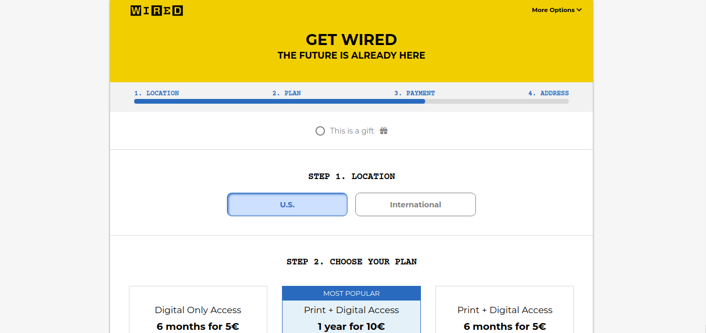
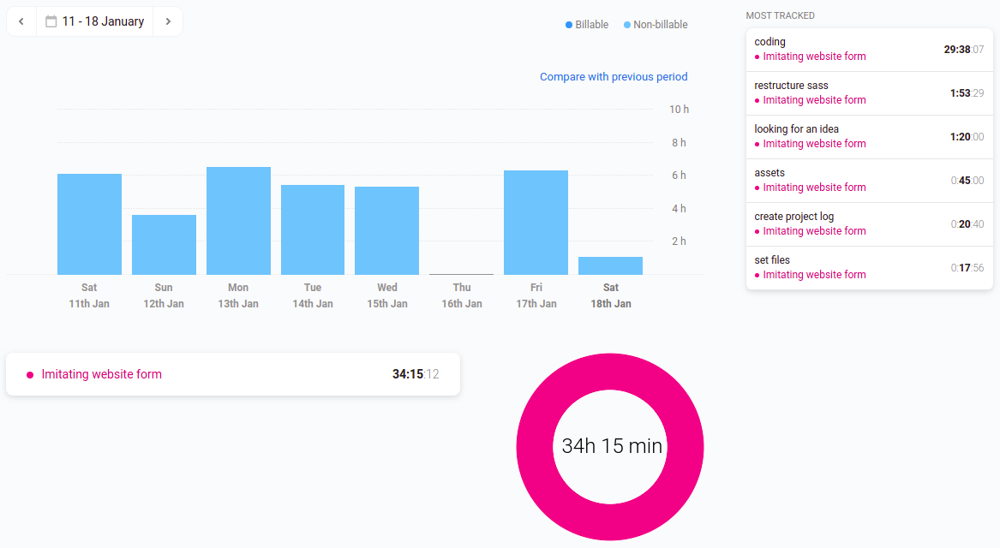

# <a href="https://jseguraweb.github.io/wired-clone/form.html">Cloning WIRED MAGAZINE form</a>

> Project of imitating a landing page and a form in order to get used to SASS and creating forms ("https://www.wired.com/") and make it responsive.

This file will be edited at the time I'm working on this project

> ## Details:

- It's about practicing. The intended user and the client is only me. 
- Goal: include it in my portfolio.
- Content required: 
    
    - Background images
    - Texts
    - font awesome icons
    - colors

> ## Priorities:

1. Start a Repository on GitHub
2. Create a Wireframe
3. Writing a README for this projects with all the keys
4. Research time: prepare content + assets
5. (Maybe) redefine Wireframe

    (ESTIMATED TIME: 1.5 hours)

6. Create files
7. Coding it for mobile first
8. Coding a desktop version

    GOAL: present a responsive website with a form to sign in and buy

## Time Estimation:

- Starting date: 11 jan 2020
- Estimated time: 15 hours of work

## Time invested

- Final date: 18 jan 2020
- Time invested: 34 hours

### How did I invested all these hours?

## New skills (to research):

- Forms
- Navigate through the different elements using JS and, of course, with a big help of the console

## Challenges + lessons learned:

- Getting used to SASS
- Keep learning JS to manipulate the HTML
- Grid
- Working with modules in Sass

## Achievements: 

- manipulate DOM with JS to manage to change the style of a specific element, change style of each plan with a click, or changing between international and US location..

## Ideas for the future:

- Create a shopping cart
